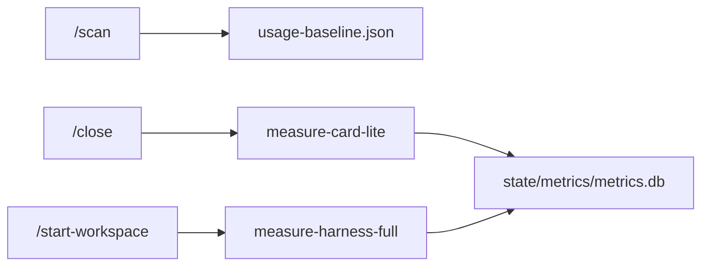

# Octo Cluster — metrics kernel

Portable metrics layer for the harness.

## Purpose

Close the PDCA loop with data:

1. Hypothesis (new rule/skill)
2. Card execution (1 chat = 1 ticket)
3. Measure (lite at close, full weekly)
4. Promote or reject via SQL trends

## Architecture

## Schema

[`engine/metrics/schema.sql`](../engine/metrics/schema.sql) — tables `cards`, `harness_snapshots`.

## Loop integration

| Phase | Script |
|-------|--------|
| `/scan` | `stamp-usage-baseline.ps1` |
| `/close` | `measure-card-lite.ps1` |
| `/start-workspace` | `measure-harness-full.ps1` (weekly if due) |
| ad hoc | `report.ps1`, `/metrics` command |

## Secrets

Never commit API tokens. Store session cookies in a **local gitignored** file if using Cursor dashboard metrics.

## Promotion criteria

- New rule/skill: measurable drop in `diff_added` or tokens without gate regressions
- Harness change: `harness_score` stable or up after CORE edit

See [`eval/metrics/README.md`](../eval/metrics/README.md).
